[English](README.md)

phpy
====
`Python` 与 `PHP` 互调用库，可以在 `PHP` 中使用 `Python` 语言的函数和类库，或者在 `Python` 中使用 `PHP` 的包。
但不是语言内嵌。编码依然使用各自的原生语法。



- 查看 [中文文档](docs/cn/README.md)  
- 支持 `Linux`/`Windows`/`macOS` 等多种操作和平台
- 不支持 Python 多线程、`async-io` 特性
- 需要 `PHP 8.1` 或更高版本

PHP 调用 Python
----
编译安装 `phpy.so` 作为扩展加载，修改 `php.ini` 追加 `extension=phpy.so` 即可。

例子：
```php
$os = PyCore::import("os");
$un = $os->uname();
echo strval($un);
```

Python 中调用 PHP
----
直接作为 `C++ Mudule` ，import 加载即可。

```python
import phpy

content = phpy.call('file_get_contents', 'test.txt')

o = phpy.Object('redis')
assert o.call('connect', '127.0.0.1', 6379)
rdata = phpy.call('uniqid')
assert o.call('set', 'key', rdata)
assert o.call('get', 'key') == rdata
```

实现原理
----
在进程内同时创建了 `ZendVM` 和 `CPython VM`，直接在进程堆栈空间内使用 `C` 函数互相调用，
开销只有 `zval <-> PyObject` 结构体转换，因此性能是非常高的。

在基准测试中我们创建了一个 `PyDict` ，分别读写 `PHP` 代码和 `Python` 代码执行 `1000万次`。
`phpy` 以 `PHP` 代码写入 `PyDict` 的性能比原生 `Python` 高 `14%`，读取性能高 `25%`。

> 详细细节请参考 [压力测试](docs/cn/benchmark.md)

微信交流群
----

