[简体中文](README-CN.md)

# phpy

A library for inter-calling `Python` and `PHP`. 
You can use Python functions and libraries in PHP, or use PHP packages in Python.



- See documents: [docs/en/README.md](docs/en/README.md)
- Supports `Linux`/`Windows`/`macOS`
- **Not support Python `threading` or `async-io` features**
- Require `PHP 8.1` or later version

## py2php
[py2php](https://swoole.com/py2php/) is online utility that will auto-translate python code into PHP code.

## Calling Python from PHP

Compile and install phpy.so as an extension, and append `extension=phpy.so` to `php.ini`.

### PHP Example:

```php
$os = PyCore::import("os");
echo $os->uname();
```

### Transformers

```php
$transformers = PyCore::import('transformers');
$AutoTokenizer = $transformers->AutoTokenizer;
$AutoModelForSequenceClassification = $transformers->AutoModelForSequenceClassification;

$os = PyCore::import('os');
$os->environ['https_proxy'] = getenv('https_proxy');

$tokenizer = $AutoTokenizer->from_pretrained("lxyuan/distilbert-base-multilingual-cased-sentiments-student");
$model = $AutoModelForSequenceClassification->from_pretrained("lxyuan/distilbert-base-multilingual-cased-sentiments-student");
```

## Calling PHP from Python
Simply import it as a C++ Mudule.

### Python Example:
```python
import phpy
content = phpy.call('file_get_contents', 'test.txt')

o = phpy.Object('redis')
assert o.call('connect', '127.0.0.1', 6379)
rdata = phpy.call('uniqid')
assert o.call('set', 'key', rdata)
assert o.call('get', 'key') == rdata
```


## Implementation

It creates `ZendVM` and `CPython VM` in the process at the same time, and directly uses C functions to call each other in the process stack space.

The overhead is only the conversion of `zval <-> PyObject` structures, so the performance is very high.

In the benchmark test, we created a `PyDict` and executed PHP code and Python code to read and write 10 million times respectively.

The performance of phpy writing `PyDict` with PHP code is `14%` higher than the native Python, and the read performance is `25%` higher.

> More details: [docs/en/benchmark.md](docs/en/benchmark.md)
