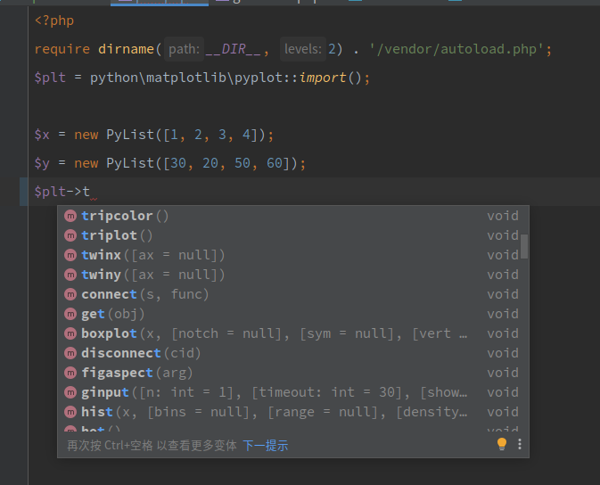

# Suggestions automatiques de l'IDE

`phpy` offre un outil de génération automatique qui peut créer des fichiers de suggestions automatiques pour les IDE. Pour l'utiliser :

```shell
cd phpy/tools
php gen-lib.php [nom du paquet Python]
```

Par exemple pour `matplotlib.pyplot` :

- Importer directement : `PyCore::import('matplotlib.pyplot')`
- Génerer le fichier de suggestions : `php tools/gen-lib.php matplotlib.pyplot`

Vous pouvez également configurer `tools/gen-all-lib.php` pour générer des fichiers de suggestions pour plusieurs paquets en une seule fois.

## Comment l'utiliser

### Installer les dépendances

```shell
composer require swoole/phpy
```

### Utiliser le suggesteur automatique

```php
require dirname(__DIR__, 2) . '/vendor/autoload.php';
$plt = python\matplotlib\pyplot::import();

$x = new PyList([1, 2, 3, 4]);
$y = new PyList([30, 20, 50, 60]);
$plt->plot($x, $y);
$plt->show();
```


